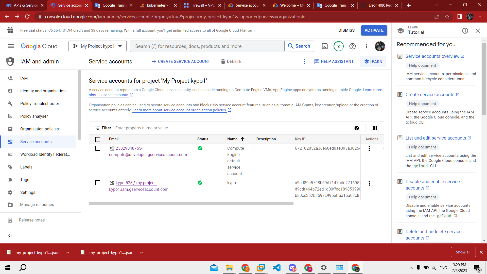

create instance ubuntu 20.04 trên google cloud

ssh vào máy ảo vừa tạo 

clone https://gitlab.ics.muni.cz/muni-kypo-crp/devops/kypo-lite.git hoặc upload file kypo-lite-fixed.zip(ít lỗi hơn)

giải nén file vừa upload 

download terrafrom 1.5.2

vào phần “IAM and admin” -> “Service accounts” click vào key của project

sau khi click chon tab “KEYS” -> “ADD KEY” -> “Create new key” chọn file .JSON nó sẽ download file có dạng abcxyz.json về máy. Đổi tên file này thành auth.json và upload phần ~/kypo-lite/tf-gcp-vm/ của máy ảo

đổi lại project id trong “provider.tf”, đoạn này anh em nhớ đổi cả “zone” và “region” trong 2 file “provider.tf” vs “instance.tf” nữa nhé( tránh gặp lỗi)

tiếp tục dung các command sau:

đến đây nếu gặp lỗi 

vào google cloud chọn project đang làm chọn “VPC network” -> “Firewall” rồi xóa firewall “allow-ssh” và chạy lại “terraform apply”

output sẽ có dạng như này

“terraform output -raw tls_private_key > gcp.key && chmod 600 gcp.key”
=> để lấy file gcp.key từ output

“ssh -i gcp.key ubuntu@`terraform output -raw public_ip_address`”
=> để ssh vào con kypo vừa tạo 
Vào root và update máy ảo

“sudo su”

“apt update”

upload lại file “kypo-lite-fixed.zip”(đã gửi trong drive) vào máy ảo mới

giải nén và vào folder ~/kypo-lite , run command

“sudo apt install -y qemu qemu-kvm libvirt-daemon libvirt-clients bridge-utils virt-manager vagrant vagrant-libvirt”

“vagrant up”

https://drive.google.com/drive/folders/1qqbhpgWxBiv9I52rmncu94KQRqVwkCA2?usp=sharing (link tải một số file cần thiết nha ae)
